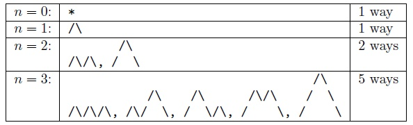

## 카탈란 수

### 응용문제 유형
#### 1. 잘짜인 괄호

#### 2. 산만들기

#### 3. 대각선피해가기

#### 4. 다각형을 삼각형으로 나누기

### 대응 전략
문제 1에서 n쌍의 괄호가 잘 배열된 방법의 수를 Cn이라고 하자.
C0, C1, C2, ... , Cn을 나타내는 길을 찾아보면 된다.
n - 1쌍의 괄호가 잘 배열된 형태에서 ()를 알맞은 곳에 넣어주는 방법의 수를 알아내면 된다.

이처럼 n쌍의 괄호가 잘 짜여진 방법의 수를 알아내기 위해서는
n-1, n-2, n-3의 방법의 수를 알아내는 점화식이 필요하게 된다.

C1 = C0C0
C2 = C0C1 + C1C0
.
.
.
이런 식으로 조합이 이루어질 수 있다.

