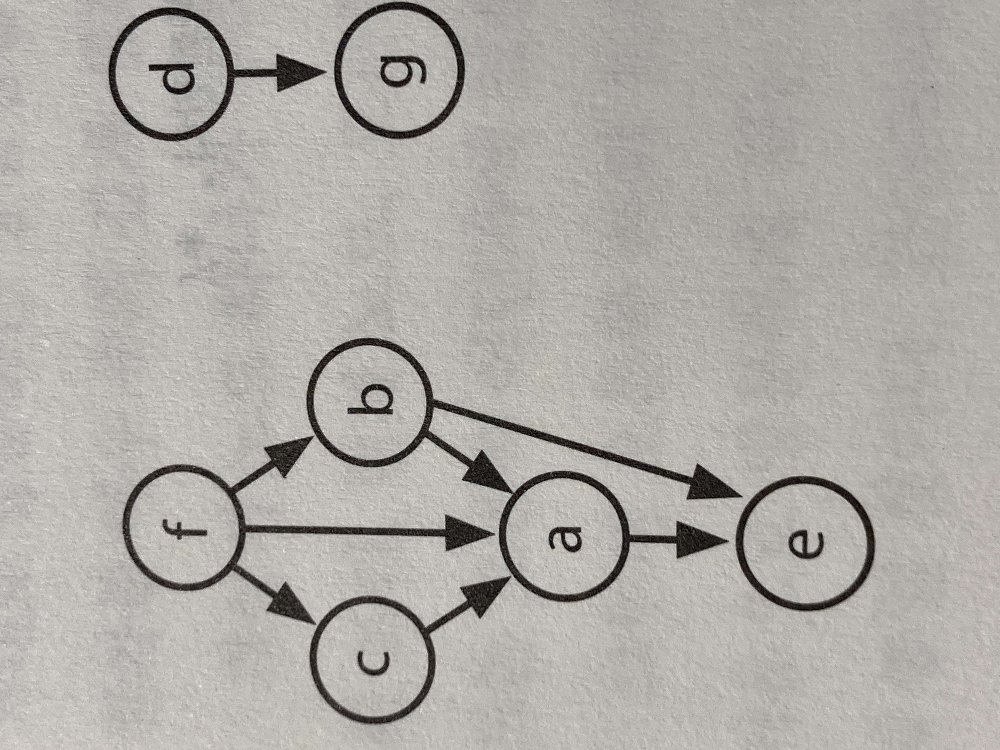

### 깊이 우선 탐색 Depth First Search : DFS

#### 예제 : 순서정하기
##### 프로젝트의 리스트와 프로젝트들 간의 종속 관계(즉, 프로젝트 쌍이 리스트로 주어지면 각 프로젝트 쌍에서 두번째 프로젝트가 첫 번째 프로젝트에 종속되어 있다는 뜻) 가 주어졌을 때, 프로젝트를 수행해 나가는 순서를 찾으라. 유효한 순서가 존재하지 않으면 에러를 반환한다.

##### 예 :
**입력:**
    프로젝트 : a, b, c, d, e, f
    종속관계 : (a, b), (f, b), (b, d), (f, a), (d, c)
**출력:** f, e, a, b, d, c

풀이  

예시의 종속관계를 그래프로 표현하면 아래와 같다. d > a, b > f, d > b, a > f, c > d 로 구성되어 있다. 아래 그림에서 임의의 노드 b 에서 시작하는 깊이 우선 탐색을 수행한다고 하자. 경로의 끝에 도달해서 더 이상 움직일 수 가 없게 되면(예를 들어 h와 e 노드에 도달하면), 이들은 가장 마지막에 수행되어야 할 프로젝트가 된다. 왜냐하면 이들에 의존하고 있는 다른 프로젝트가 없기 때문이다. 

이제 DFS 수행 중에 **노드 e에서 노드 a**로 되돌아오면 어떤 일이 발생할까.
a에 종속된 프로젝트들은 모두 a다음에 실행되어야 한다. 따라서 a에 종속된 프로젝트에서 되돌아오면 아래와 같이 b 가 종속되어 있는 a, e, h 에서 모두 되돌아 와서 b가 최종 해당 관계에서 최종 프로젝트가 되므로 b를 그들 앞에 추가하고 다음 노드를 진행한다.
~~~
DFS(b)
    DFS(h)
        build order = ..., h
    DFS(a)
        DFS(e)
            build order = ..., e, h
        build order = ..., a, e, h
    DFS(e) -> return
    build order = ..., b, a, e, h
~~~
b, a, e, h 는 이미 탐색이 끝난 프로젝트들.
이미 탐색이 끝난 프로젝트 중에서 중복이 있다면 다시 원래 노드로 돌아간 것이므로 사이클이 있다고 생각. 무한루프에 빠지지 않기 위해 사이클이 있으면 경고 메세지를 표시하고 다시 탐색하지 않도록 상태를 기록해야함.

이렇게 반복해서 남아있는 노드가 없을때 완료
**시간 복잡도가 O(P + D)**
P는 프로젝트의 개수, D가 종속관계를 표현하는 쌍의 개수.

이런 문제를 **위상정렬** 이라고 함. 어떤 그래프의 간선 (a, b)가 a전에 b가 나타나야 하는 조건을 나타낼때, **노드를 선형 순서대로 나열하는 방법**을 말한다.